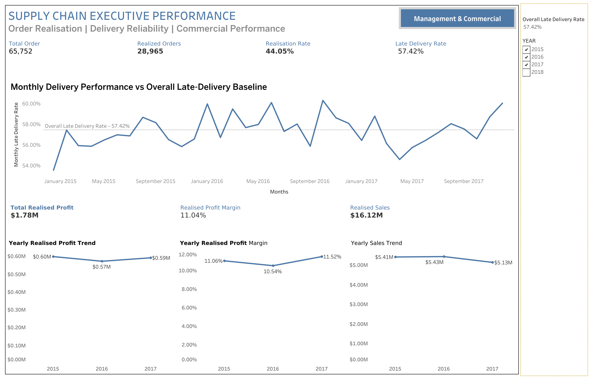
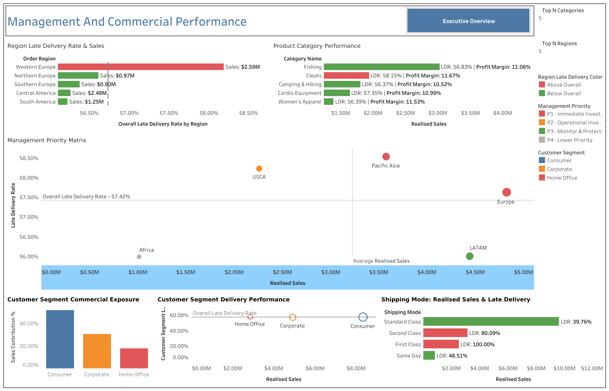

# Supply Chain Service & Commercial Performance Analytics

## SQL | Tableau | Supply Chain Analytics | Commercial Performance


---

## 1. Project Overview

This project analyses supply chain delivery performance and commercial exposure using the **DataCo SMART Supply Chain for Big Data Analysis** dataset.

The key business question is:

> **Where are the most significant supply chain performance gaps, how do they relate to commercial exposure, and where should management prioritise improvement?**

SQL was used for data preparation, validation and analysis, while Tableau was used to develop management-focused dashboards.

**Analytical flow:**

**Performance → Diagnosis → Commercial Exposure → Management Priorities → Recommendations**

---

## 2. Business Problem

A single late-delivery KPI can identify a service problem but does not show where management should focus.

The analysis therefore evaluates delivery performance across:

- Markets & regions
- Product categories
- Shipping modes
- Customer segments
- Time periods

Commercial exposure is assessed using:

- Realised sales
- Order volume
- Calculated profit proxy
- Profit margin
- Sales contribution

The aim is to prioritise areas based on **both operational performance and business impact**, rather than late-delivery percentage alone.

---

## 3. Project Objectives

- Establish and validate core supply chain KPIs
- Measure order realisation and delivery reliability
- Identify persistent delivery-performance patterns
- Compare markets, regions, products, shipping modes and customer segments
- Connect operational performance with commercial exposure
- Develop a management priority framework
- Translate analytical findings into practical recommendations

---

## 4. Dataset

**DataCo SMART Supply Chain for Big Data Analysis**

The dataset contains transaction-level information covering orders, customers, products, sales, delivery status, shipping modes and geographic attributes.

| Attribute | Detail |
|---|---|
| Records | 180,519 |
| Raw columns | 53 |
| Distinct orders | 65,752 |
| Customers | 20,652 |
| Period | Approx. Jan 2015 – Jan 2018 |
| Analytical grain | Order-item / transaction |

### Data Source

Mendeley Data:  
[DataCo SMART SUPPLY CHAIN FOR BIG DATA ANALYSIS](https://data.mendeley.com/datasets/8gx2fvg2k6/3)

**Version:** 3  
**DOI:** 10.17632/8gx2fvg2k6.3  
**Licence:** CC BY 4.0

The raw dataset is not included in this repository.

---

## 5. Data Quality & Preparation

A data audit was performed before analysis.

Key actions included:

- Standardising data types and categorical fields
- Creating date and revenue-eligibility fields
- Validating transaction-level grain
- Aggregating transactions to order level where required
- Removing/excluding fields with limited analytical value

Key data-quality observations:

- `Product Description`: 100% missing
- `Order Zipcode`: ~86% missing
- Geography was analysed using available market, region, state and city fields
- `Order Item Id` was treated as the transaction-level identifier

---

## 6. KPI & Revenue Definitions

For this project, transactions with **COMPLETE** or **CLOSED** status were treated as revenue-eligible.

This is an **analytical definition**, not an accounting revenue-recognition policy.

### Core KPIs

| KPI | Result |
|---|---:|
| Total Orders | 65,752 |
| Realised Orders | 28,965 |
| Realisation Rate | 44.05% |
| Late Realised Orders | 16,633 |
| Late Delivery Rate | 57.42% |
| Realised Sales Proxy | $16.12M |
| Calculated Profit Proxy | $1.78M |
| Calculated Profit Margin | 11.04% |

**Realisation Rate** = Realised Orders / Total Orders

**Late Delivery Rate** = Late Realised Orders / Realised Orders

**Realised Sales Proxy** = Sales associated with COMPLETE and CLOSED transactions.

---

## 7. Profit Data Limitation

The `Order Profit Per Order` field does not consistently contain a single value per Order ID.

Approximately **69.4% of realised orders contain multiple distinct values**.

Therefore, the analysis reports the resulting measure as a **Calculated Profit Proxy**, rather than accounting-grade profit.

This measure is used for comparative commercial analysis across markets, products and customer segments.

---

## 8. Analytical Approach

```text
Raw Data
   ↓
Data Audit & Preparation
   ↓
SQL KPI Analysis
   ↓
Delivery Performance Analysis
   ↓
Commercial Exposure Analysis
   ↓
Management Priority Framework
   ↓
Tableau Dashboards
   ↓
Business Recommendations
```

The analysis combines:

**Operational Performance + Commercial Exposure**

to identify areas requiring management attention.

---

## 9. Key Findings

### Overall Performance

- **57.42% of realised orders were delivered late**, indicating a significant service-performance issue.
- Monthly late-delivery rates remained broadly between **53.53% and 60.28%**, suggesting a persistent issue rather than a single-period spike.

### Market Performance

Europe and Pacific Asia are key management priorities because both combine **above-baseline late delivery with significant commercial exposure**.

| Market | Late Delivery Rate | Realised Sales | Sales Contribution |
|---|---:|---:|---:|
| Europe | 57.96% | $4.82M | 29.93% |
| Pacific Asia | 58.09% | $3.58M | 22.18% |
| LATAM | 55.72% | $4.44M | 27.57% |

### Shipping Mode Performance

Shipping performance varies significantly across shipping modes.

| Shipping Mode | Realised Orders | Late Delivery Rate | Realised Sales |
|---|---:|---:|---:|
| Standard Class | 17,285 | 39.76% | $9.62M |
| Second Class | 5,635 | 80.09% | $3.14M |
| First Class | 4,497 | 100.00% | $2.52M |
| Same Day | 1,548 | 48.51% | $0.84M |

First Class and Second Class show substantially higher late-delivery rates than Standard Class and warrant further investigation.

### Product Performance

**Cleats** represents a notable improvement opportunity:

- **8,882** realised orders
- **$1.93M** realised sales
- **58.15%** late-delivery rate

This combines meaningful commercial exposure with an above-baseline late-delivery rate.

### Customer Segment Performance

The **Consumer** segment represents the largest commercial exposure:

- **15,000** realised orders
- **$8.34M** realised sales
- **51.74%** of realised sales
- **57.44%** late-delivery rate

Given its scale, even incremental improvements in delivery performance could have meaningful commercial relevance.

---

## 10. Management Priority Framework

The overall **57.42% late-delivery rate** is used as the performance baseline.

Priorities combine:

- Delivery performance relative to the baseline
- Commercial exposure
- Order volume
- Profit exposure

| Priority | Area | Management Focus |
|---|---|---|
| **P1** | Pacific Asia & Europe | High service-performance and commercial exposure |
| **P2** | USCA | Above-baseline delivery performance |
| **P3** | LATAM | Protect performance and monitor |
| **P4** | Africa | Lower immediate commercial priority |

The framework focuses management attention on **business impact rather than late-delivery percentage alone**.

---

## 11. Tableau Dashboards

The SQL analysis was translated into two management-focused Tableau dashboards.

### Executive Supply Chain Performance

Provides an executive view of:

- Order volume and realisation
- Late-delivery performance
- Realised sales
- Calculated profit proxy
- Profit margin
- Monthly and annual trends



### Management & Commercial Performance

Provides deeper analysis of:

- Regional delivery performance and sales
- Product category performance
- Management priority matrix
- Customer segment exposure
- Shipping mode performance



---

## 12. Business Recommendations

### 1. Prioritise Europe & Pacific Asia

Conduct deeper operational investigation across regions, shipping modes and product categories to identify where delivery-performance gaps are concentrated.

### 2. Investigate First & Second Class Shipping

Review route, market, product mix and scheduling patterns associated with the significantly higher late-delivery rates before making changes to shipping policies.

### 3. Focus on Commercially Significant Products

Prioritise product categories where **high order volume, significant commercial exposure and above-baseline late delivery** occur together.

### 4. Protect Consumer Segment Performance

Given its **51.74% sales exposure**, monitor Consumer delivery performance closely and identify opportunities for incremental service improvement.

### 5. Establish Ongoing KPI Monitoring

Use the **57.42% late-delivery rate as a baseline** and monitor performance regularly across markets, products, shipping modes and customer segments.

### 6. Prioritise Improvement by Business Impact

Use:

**Late-delivery gap + Sales exposure + Profit exposure + Order volume**

to direct improvement resources towards areas with the greatest potential business impact.

### Overall Recommendation

> **Move from simply measuring late delivery to prioritising service issues based on commercial impact, followed by deeper operational investigation before implementing specific process changes.**

---

## 13. Limitations

- **Revenue definition:** COMPLETE and CLOSED transactions were treated as revenue-eligible for analytical purposes. This is a project-specific analytical assumption, not an accounting policy.
- **Profit measure:** `Order Profit Per Order` does not consistently contain a single value per Order ID. Therefore, profit is presented as a **Calculated Profit Proxy**.
- **Causality:** The analysis identifies patterns and associations but does not establish causal relationships or root causes.
- **Dataset scope:** Findings are based on the historical DataCo SMART Supply Chain dataset and should be interpreted within its scope.

---

## 14. Tools & Skills

### Tools

- **SQL / DuckDB** – Data preparation, KPI calculations, aggregations, joins, CTEs, window functions and validation
- **Tableau** – Interactive dashboards, KPI reporting and management visualisation
- **Python / Jupyter** – Data preparation, data-quality validation and analytical workflow
- **GitHub** – Version control and portfolio presentation

### Analytical Skills

- Supply Chain Analytics
- KPI Development & Validation
- Data Quality Assessment
- Operational Performance Analysis
- Commercial Analytics
- Data Visualisation
- Management Reporting
- Business Problem Solving
- Insight Generation
- Decision Support

---

## 15. Portfolio Skills Demonstrated

This project demonstrates the ability to:

- Translate a business problem into analytical questions
- Work with transaction-level supply chain data
- Validate and prepare real-world datasets
- Build business KPIs using SQL
- Connect operational performance with commercial exposure
- Develop management-focused Tableau dashboards
- Create a data-driven prioritisation framework
- Translate analysis into actionable recommendations
- Communicate data limitations transparently

---

## Conclusion

This project demonstrates an end-to-end approach to **Supply Chain and Commercial Analytics**, using SQL and Tableau to transform transactional data into management-level insights.

> **Measure performance → Understand commercial exposure → Prioritise action → Support decisions**
